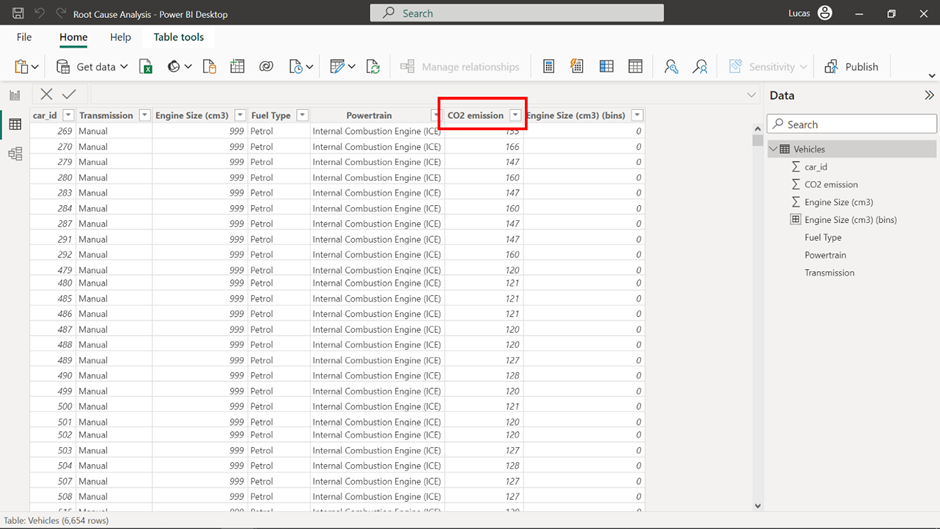
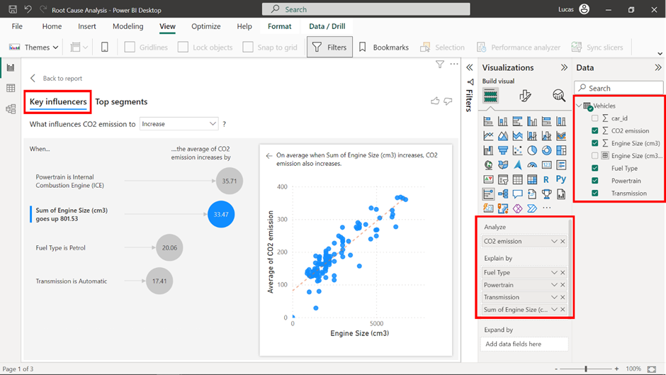
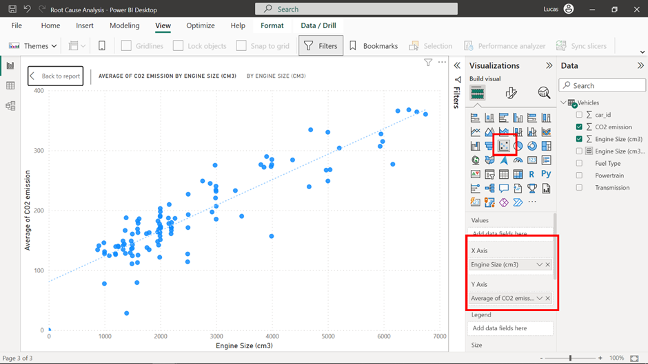
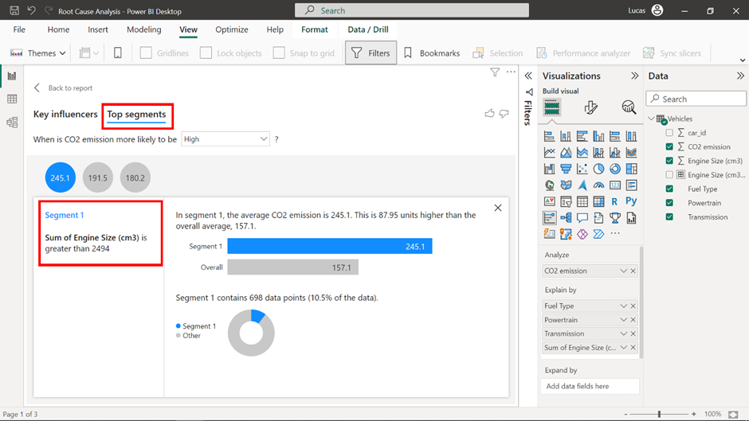
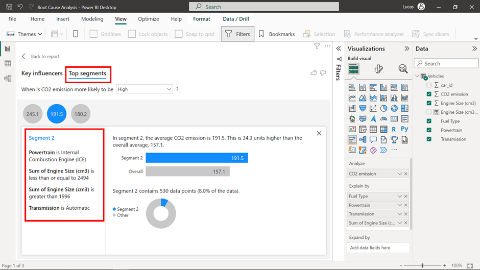
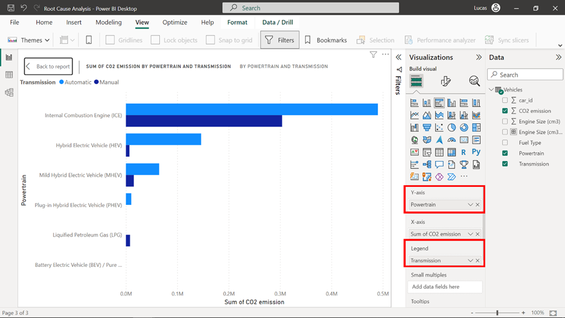
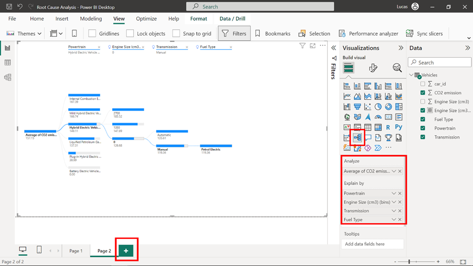
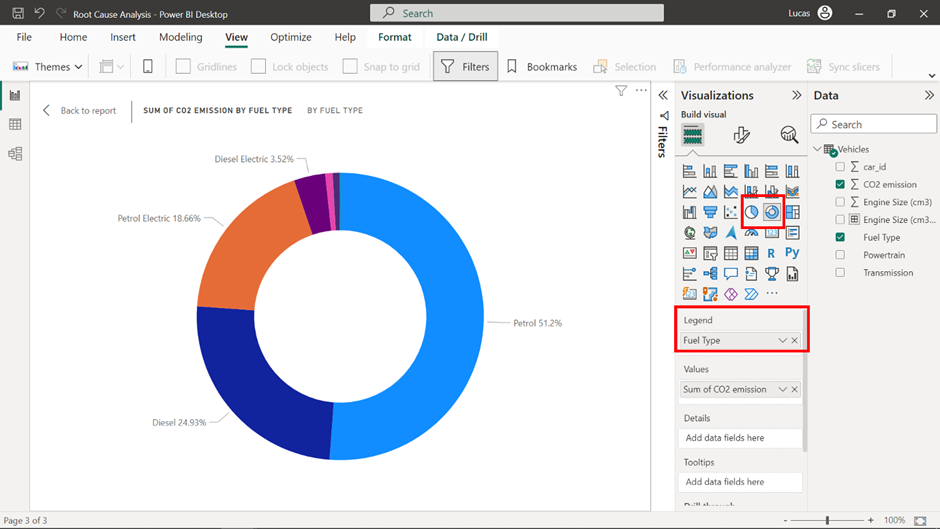
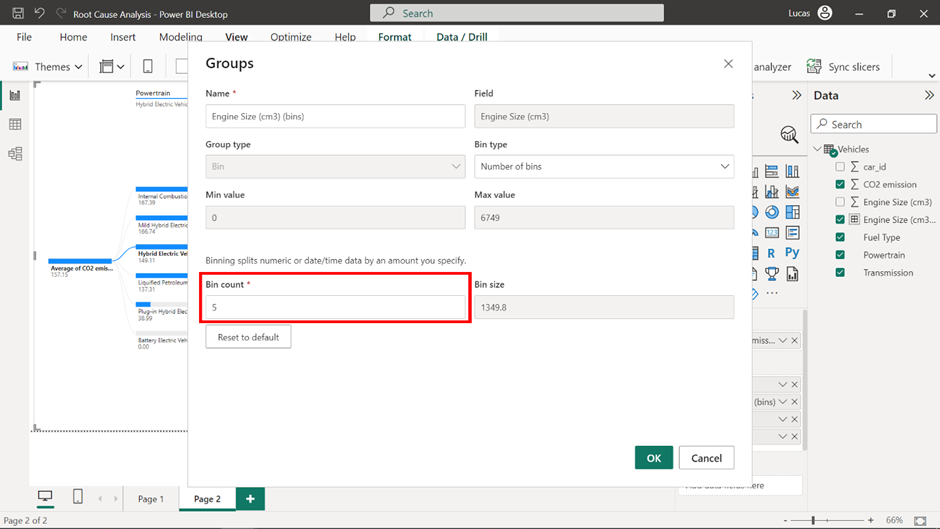
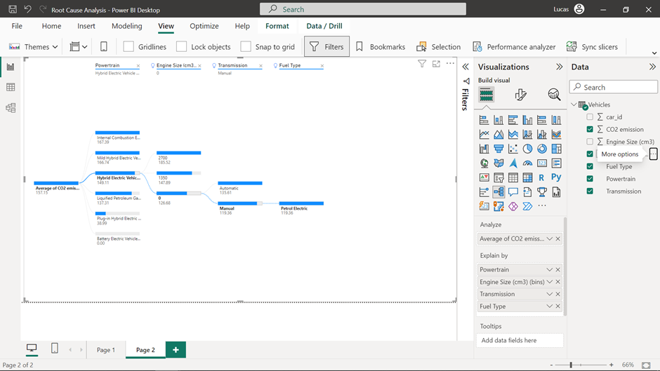

# CO₂ Emissions Root Cause Analysis — Power BI


---

# 📊 Project Overview

This project investigates the factors associated with **CO₂ emissions from vehicles** using Microsoft Power BI.

The objective was to move beyond descriptive reporting and perform a **root cause analysis** of vehicle emissions by identifying the characteristics most strongly associated with variations in CO₂ emissions.

The analysis combines Power BI's specialized analytical visuals with traditional data visualization techniques to answer questions such as:

* Which vehicle characteristics are most associated with CO₂ emissions?
* How does engine size relate to average CO₂ emissions?
* How do powertrain and transmission interact with emissions?
* Which fuel types account for the majority of emissions?
* Can AI-assisted analysis identify combinations of vehicle characteristics associated with lower emissions?
* How can the results be presented in an interactive report for business users?

---

# 🎯 Business Problem

Transportation is an important source of greenhouse gas emissions.

For this analysis, the business objective is to understand which **vehicle characteristics are associated with higher or lower CO₂ emissions**.

Rather than looking at individual vehicles independently, the analysis investigates broader factors including:

* Engine size
* Powertrain
* Transmission
* Fuel type
* Other vehicle attributes

The central analytical question is:

> **Which vehicle characteristics help explain differences in CO₂ emissions?**

---

# 🛠️ Tools & Technologies

| Tool / Feature                 | Purpose                                            |
| ------------------------------ | -------------------------------------------------- |
| **Microsoft Power BI Desktop** | Report development and analysis                    |
| **Key Influencers**            | Identify factors associated with CO₂ emissions     |
| **Top Segments**               | Discover combinations of influencing attributes    |
| **Decomposition Tree**         | Interactive root cause exploration                 |
| **AI Split**                   | Identify high/low values in the decomposition tree |
| **Scatter Plot**               | Analyze engine size vs. emissions                  |
| **Donut Chart**                | Compare fuel-type contributions                    |
| **Column/Bar Visualization**   | Compare powertrain and transmission                |
| **Data Grouping / Binning**    | Transform engine size into analytical ranges       |

---

# 📁 Repository Structure

```text
powerbi-co2-emissions-root-cause-analysis/
│
├── README.md
│
├── dashboard/
│   └── CO2_Emissions_Root_Cause_Analysis.pbix
│
├── screenshots/
│   ├── 01-data-exploration.png
│   ├── 02-key-influencers.png
│   ├── 03-engine-size-scatter.png
│   ├── 04-top-segments.png
│   ├── 05-powertrain-transmission.png
│   ├── 06-fuel-type.png
│   ├── 07-engine-size-binning.png
│   ├── 08-decomposition-tree.png
│   ├── 09-ai-low-value-analysis.png
│   └── 10-final-dashboard.png
│
└── documentation/
    └── analysis-notes.md
```

---

# 🔎 1. Data Exploration

The first step was to inspect the `Vehicles` table and identify the fields that could potentially explain variations in CO₂ emissions.

The primary analytical metric is:

```text
CO2 emission
```

The main explanatory variables include:

* `Engine Size (cm3)`
* `Transmission`
* `Fuel Type`
* `Powertrain`

The `car_id` field was treated as an identifier rather than an analytical variable.

### Data fields

| Field             | Analytical role               |
| ----------------- | ----------------------------- |
| CO2 emission      | Main target metric            |
| Engine Size (cm3) | Engine characteristic         |
| Powertrain        | Vehicle propulsion technology |
| Transmission      | Transmission technology       |
| Fuel Type         | Energy/fuel category          |
| car_id            | Vehicle identifier            |

### Screenshot



01-data-exploration.png
```

---

# 🚗 2. Establishing the Dataset Scope

A KPI card was created to show the number of vehicles included in the analysis.

### KPI

```text
Vehicles analyzed
```

The `car_id` field was counted because each row represents an individual vehicle.

This provides an immediate indication of the size of the dataset being analyzed.

### Screenshot


---

# 🤖 3. Identifying Key Influencers of CO₂ Emissions

Power BI's **Key Influencers** visual was used to investigate the factors associated with the `CO2 emission` metric.

### Configuration

**Analyze**

```text
CO2 emission
```

**Explain by**

```text
Engine Size (cm3)
Transmission
Fuel Type
Powertrain
```

The Key Influencers visual automatically evaluates relationships between the analyzed metric and the explanatory variables.

This provides an initial view of which vehicle characteristics are associated with differences in CO₂ emissions.

### Screenshot


```

---

# 📈 4. Engine Size vs. CO₂ Emissions

One of the most relevant relationships identified during the Key Influencers analysis was the relationship between:

```text
Engine Size (cm3)
```

and

```text
Average CO2 emission
```

A dedicated scatter plot was therefore created.

### Scatter plot configuration

**X-axis**

```text
Engine Size (cm3)
```

**Y-axis**

```text
Average of CO2 emission
```

The Y-axis was explicitly configured to use **Average** rather than Sum because the objective is to compare the typical emission level associated with engine size.

### Screenshot


```

### Analytical interpretation

The scatter plot provides a more direct view of how emissions vary across engine sizes and complements the automated findings from the Key Influencers visual.

---

# 🧩 5. Discovering Influencing Groups with Top Segments

The **Top Segments** functionality was then used to investigate combinations of vehicle characteristics.

This step moves the analysis from individual variables toward **groups of attributes** that may jointly explain differences in emissions.

The analysis highlighted:

* Engine Size
* Powertrain
* Transmission

as important components of the identified segments.

### Screenshot


```

---

# ⚙️ 6. Powertrain and Transmission Analysis

The Top Segments analysis indicated that **Powertrain and Transmission**, particularly when considered together, were relevant dimensions for understanding emissions.

A dedicated visualization was therefore created to investigate their relationship.

### Visualization configuration

**Axis**

```text
Powertrain
```

**Legend**

```text
Transmission
```

**Value**

```text
CO2 emission
```

Powertrain was used as the main axis because it contains a higher number of categories than Transmission.

### Screenshot


```

### Analytical purpose

This visualization allows users to compare emission levels across propulsion technologies while simultaneously considering transmission type.

---

# ⛽ 7. Fuel Type Contribution

Fuel Type was also investigated as a potential explanatory factor.

The analysis identified a small number of fuel categories accounting for the majority of CO₂ emissions in the dataset.

Because the number of relevant categories was relatively small, a donut chart was selected.

### Visualization configuration

```text
Legend → Fuel Type
Values → CO2 emission
```

### Screenshot


```

### Analytical purpose

The visualization provides a high-level view of how emissions are distributed across fuel categories.

---

# 🌳 8. Building an Interactive Decomposition Tree

A second report page was created using Power BI's **Decomposition Tree**.

The purpose of this page is to allow users to interactively drill down through the different vehicle characteristics contributing to average CO₂ emissions.

### Analyze

```text
Average CO2 emission
```

### Explain by

```text
Engine Size (cm3)
Powertrain
Transmission
Fuel Type
```

The decomposition tree transforms the analysis into an interactive hierarchy.

Instead of presenting only a static conclusion, users can select different branches and investigate the data themselves.

### Screenshot


```

---

# 📦 9. Grouping Engine Size into Bins

Engine Size contains a relatively large number of possible values, which can make direct exploration in a decomposition tree difficult.

To improve usability, engine sizes were grouped into **five equal-sized bins**.

### Transformation

```text
Engine Size
       ↓
New Group
       ↓
5 equal-sized bins
```

The original Engine Size field was replaced in the decomposition tree by the newly created grouped field.

### Why bin the data?

Grouping continuous or high-cardinality numerical values makes the hierarchy easier to navigate and allows users to identify broader engine-size ranges rather than individual values.

### Screenshot


```

---

# 🧠 10. AI-Assisted Root Cause Exploration

The decomposition tree was then used to investigate combinations of attributes associated with lower average CO₂ emissions.

The analysis started with:

```text
Powertrain
```

The AI functionality was then used to identify **Low value** branches for subsequent dimensions.

This allows the user to interactively explore which combinations of vehicle characteristics correspond to lower average CO₂ emissions.

### Example analytical path

```text
Powertrain
      ↓
Low value
      ↓
Engine Size Group
      ↓
Low value
      ↓
Transmission
      ↓
Low value
```

The resulting branch provides a specific combination of vehicle characteristics associated with a lower average CO₂ emission level within the dataset.

### Screenshot


```

---

# 📊 11. Final Dashboard

The final report brings together the most useful analytical views into a structured Power BI dashboard.

The report contains:

### Executive KPI

Number of vehicles analyzed.

### Key Influencers

Identifies vehicle characteristics associated with CO₂ emissions.

### Engine Size Analysis

Shows the relationship between engine size and average CO₂ emissions.

### Powertrain & Transmission

Compares emissions across propulsion and transmission configurations.

### Fuel Type

Shows the contribution of different fuel categories.

### Decomposition Tree

Allows users to interactively investigate combinations of vehicle characteristics.

---

# 🖥️ Final Report


```

---

# 🔬 Analytical Workflow

The project followed a structured root cause analysis methodology:

```text
Raw Vehicle Data
       │
       ▼
Data Exploration
       │
       ▼
Identify CO₂ Metric
       │
       ▼
Key Influencers
       │
       ├───────────────┐
       ▼               ▼
Engine Size       Top Segments
       │               │
       ▼               ▼
Scatter Plot     Powertrain +
                 Transmission
       │               │
       └───────┬───────┘
               ▼
          Fuel Analysis
               │
               ▼
       Decomposition Tree
               │
               ▼
        AI-assisted Analysis
               │
               ▼
        Business Dashboard
```

---

# 💡 Key Findings

The analysis identified several dimensions associated with differences in vehicle CO₂ emissions.

### 1. Engine Size

Engine size emerged as an important analytical dimension.

The dedicated scatter plot allows the relationship between engine size and average CO₂ emissions to be examined directly.

### 2. Powertrain

Powertrain was identified as an important dimension in the automated analysis and was incorporated into the interactive decomposition tree.

### 3. Transmission

Transmission provided additional explanatory information, particularly when analyzed together with Powertrain.

### 4. Fuel Type

A limited number of fuel categories accounted for the majority of the CO₂ emissions represented in the dataset.

### 5. Combined Factors

The Top Segments and Decomposition Tree analyses demonstrate that emissions should not necessarily be interpreted through a single variable.

Combinations of:

```text
Engine Size
+
Powertrain
+
Transmission
+
Fuel Type
```

provide a more detailed way of exploring differences between vehicles.

---

# 🧠 What This Project Demonstrates

This project demonstrates practical experience with **AI-assisted business intelligence and exploratory data analysis**.

### Power BI

* Key Influencers
* Top Segments
* Decomposition Tree
* AI-assisted analysis
* Scatter plots
* Donut charts
* KPI cards
* Interactive reports
* Data grouping and binning

### Data Analysis

* Exploratory Data Analysis
* Root cause analysis
* Relationship analysis
* Segmentation
* Cardinality considerations
* Continuous-variable binning
* Multidimensional analysis

### Business Intelligence

* Translating a business question into analytical dimensions
* Selecting appropriate visualizations
* Combining automated insights with manual analysis
* Building interactive analytical reports
* Communicating findings to non-technical stakeholders

---

# 📌 Why These Visualizations?

Visualization selection was based on the structure of the data and the analytical question.

| Analytical question                          | Visualization      | Reason                            |
| -------------------------------------------- | ------------------ | --------------------------------- |
| How many vehicles are analyzed?              | KPI Card           | Fast KPI overview                 |
| What influences CO₂ emissions?               | Key Influencers    | Automated factor analysis         |
| How does engine size relate to emissions?    | Scatter Plot       | Relationship analysis             |
| Which combinations of factors matter?        | Top Segments       | Segment discovery                 |
| How do Powertrain and Transmission interact? | Bar/Column Chart   | Category comparison               |
| How are emissions distributed by fuel?       | Donut Chart        | Part-to-whole comparison          |
| How can users investigate root causes?       | Decomposition Tree | Interactive hierarchical analysis |

---

# 🚀 Potential Improvements

Several extensions could make the analysis even more comprehensive:

* Add vehicle manufacturer analysis
* Add geographic comparisons
* Add additional environmental indicators
* Create dedicated KPI cards for average and maximum emissions
* Add emission distribution histograms
* Create an executive summary page
* Add drill-through pages for individual vehicle categories
* Add interactive bookmarks
* Add navigation buttons between report pages
* Add additional DAX measures
* Publish the report through Power BI Service
* Implement scheduled data refresh for a production scenario

---

# 📂 How to Use the Project

## Requirements

To open the Power BI report:

* Microsoft Power BI Desktop
* Compatible Windows environment

The `.pbix` file is located in:

```text
dashboard/
```

Open:

```text
CO2_Emissions_Root_Cause_Analysis.pbix
```

---

# 📷 Dashboard Preview

The following image should be used as the main GitHub preview:

**[ADD-IMAGE-12: Clean high-resolution screenshot of the final dashboard]**

```markdown

```

---

# ⚠️ Dataset & Attribution

This project uses an environmental/vehicle dataset provided for educational analytical purposes.

The underlying dataset is not claimed as proprietary original data.

The Power BI report structure, analytical workflow, visualization choices and portfolio documentation are presented to demonstrate practical skills in data analysis and business intelligence.

---

# 🎓 Project Context

This project was developed as a practical Power BI analytics case study focused on **root cause analysis and business storytelling**.

Rather than relying solely on standard charts, the analysis uses Power BI's specialized AI-assisted visuals to investigate relationships within the dataset.

The project demonstrates how automated analytical capabilities can be combined with human-driven visualization and interpretation.

---

# 👤 Author

**Ulrich Arthur Konkobo**

Master's Student — Data Science & Artificial Intelligence

### Technical Skills

`Power BI` · `Python` · `SQL` · `Data Analysis` · `Machine Learning` · `MLOps` · `Cloud`

---

# ⭐ Project Summary

| Category              | Details                                           |
| --------------------- | ------------------------------------------------- |
| **Project**           | CO₂ Emissions Root Cause Analysis                 |
| **Domain**            | Environmental / Automotive Analytics              |
| **Tool**              | Microsoft Power BI                                |
| **Main Metric**       | CO₂ Emission                                      |
| **Key Influencers**   | Engine Size, Powertrain, Transmission, Fuel Type  |
| **Advanced Features** | Key Influencers, Top Segments, Decomposition Tree |
| **Analysis Type**     | Exploratory & Root Cause Analysis                 |
| **Output**            | Interactive Power BI Report                       |

---

> **From raw vehicle data to root cause exploration — this project demonstrates how Power BI's AI-assisted analytical capabilities can uncover patterns, relationships and segments within complex datasets.**
